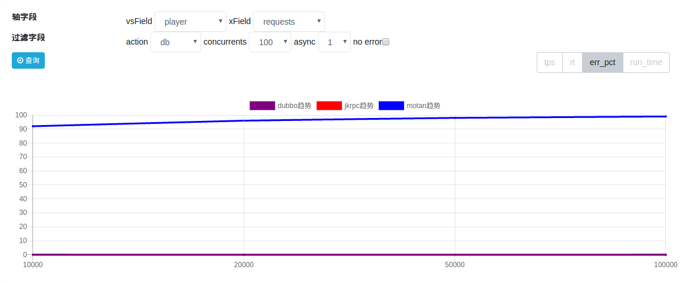
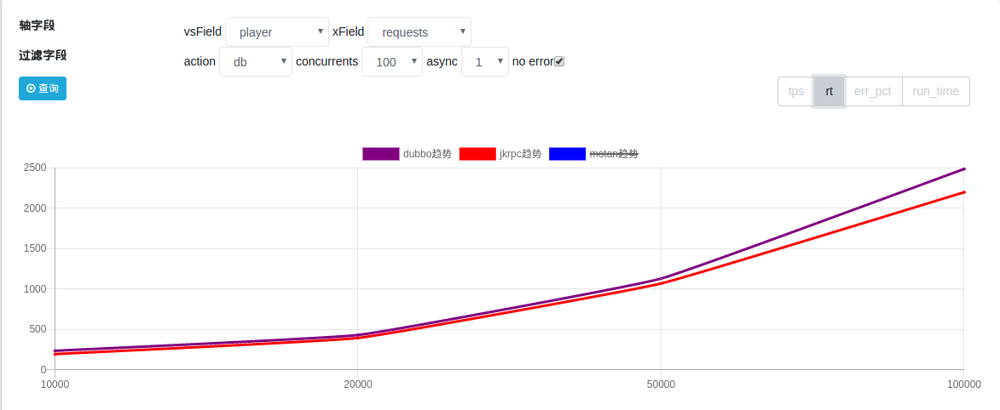

# 性能测试

我分别针对 jkrpc(jksoa-rpc) / dubbo / motan 等3个框架进行性能测试

以下是我们测试的结果：

# 测试环境

## 硬件配置

     Server端：
     CPU：model name:Intel(R) Xeon(R) CPU E5-2620 v2 @ 2.10GHz,cache size: 15360 KB,processor_count : 24
     内存：16G
     网络：千兆网卡
     硬盘：900GB

     Client端：
     CPU：model name:Intel(R) Xeon(R) CPU E5-2620 v2 @ 2.10GHz,cache size: 15360 KB,processor_count : 24
     内存：16G
     网络：千兆网卡
     硬盘：900GB

## 软件配置

     JDK版本：
     java version "1.8.0_172"
     Java(TM) SE Runtime Environment (build 1.8.0_172-b11)
     Java HotSpot(TM) 64-Bit Server VM (build 25.172-b11, mixed mode)

     JVM参数：
     java -Djava.net.preferIPv4Stack=true -server -Xms1g -Xmx1g -XX:PermSize=128m

# 测试脚本

## Server测试场景：

    并发多个Client，连接数50，并发数100，测试Server极限性能

## Client测试场景：

    单客户端，10连接，在并发数分别为1，20，50，100的情况下，分别进行如下场景测试：
    - nth, 啥都不干, 实现见 `BenchmarkService::doNothingAsync()`
    - cache, 读缓存(内存), 实现见 `BenchmarkService::getMessageFromCacheAsync()`
    - file, 读文件, 实现见 `BenchmarkService::getMessageFromFileAsync()`
    - db, 读db, 实现见 `BenchmarkService::getMessageFromDbAsync()`

从上往下, 逐渐越来阻塞

# 3rpc框架对比测试: jkrpc / dubbo / motan

## 测试对象

### jkrpc
1. 版本: 1.9.0

2. 线程池大小: [20, 800], 队列大小: 100000000

jksoa-benchmark/jkrpc/src/main/resources/common-pool.yaml

```
## 公共线程池的配置
## 初始线程数
corePoolSize: 20
## 最大线程数
maximumPoolSize: 800
## 队列大小
queueSize: 100000000
```

3. client端连接: 10, 请求超时: 100秒

jksoa-benchmark/jkrpc/src/main/resources/rpc-client.yaml

```
connectTimeoutMillis: 500 ## 连接超时，int类型，单位：毫秒
requestTimeoutMillis: !!java.lang.Long 100000 ## 请求超时，Long类型，单位：毫秒

connectType: fixed ## 连接类型: 1 reused 复用单一连接 2 pooled 连接池 3 fixed 固定几个连接
lazyConnect: false ## 是否延迟创建连接
minConnections: 10 ## 最小连接数, 用在 PooledConnection/FixedConnection
maxConnections: 10 ## 最大连接数, 用在 PooledConnection, 用在 PooledConnection
```

### dubbo
1. 版本: 2.7.2

2. 线程池大小: [20, 800], 队列大小: 100000000

jksoa-benchmark/dubbo/src/main/resources/spring/dubbo-provider.xml

```
<dubbo:protocol name="dubbo" dispatcher="all" threadpool="eager" corethreads="20" threads="800" queues="100000000"/>
```

3. client端连接: 10, 请求超时: 100秒

jksoa-benchmark/dubbo/src/main/resources/spring/dubbo-consumer.xml

```
<dubbo:reference id="benchmarkService" check="false" interface="net.jkcode.jkbenchmark.rpc.common.api.IBenchmarkService"
                     timeout="100000" connections="10"/>
```

### motan
1. 版本: 1.1.6

2. 线程池大小: [20, 800], 队列大小: 100000000

jksoa-benchmark/motan/src/main/resources/motan-server.xml

```
<!-- 协议配置。为防止多个业务配置冲突，推荐使用id表示具体协议。-->
<motan:protocol id="benchmarkMotan" default="true" name="motan"
                requestTimeout="20000" maxServerConnection="80000" maxContentLength="1048576"
                maxWorkerThread="800" minWorkerThread="20" workerQueueSize="100000000"/>
```

3. client端连接: 10, 请求超时: 100秒

jksoa-benchmark/motan/src/main/resources/motan-client.xml

```
<!-- motan协议配置 -->
<motan:protocol default="true" name="motan" haStrategy="failfast"
                loadbalance="roundrobin" maxClientConnection="10" minClientConnection="10"/>

<!-- 具体referer配置。使用方通过beanid使用服务接口类 -->
<motan:referer id="asyncBenchmarkService" directUrl="127.0.0.1:8002"
               interface="net.jkcode.jkbenchmark.rpc.common.api.motan.IMotanBenchmarkServiceAsync"
               connectTimeout="500" requestTimeout="100000" basicReferer="motanClientBasicConfig"
               async="true"/>
```

## 测试结果


[结果sql](result/rpc/result.sql)

1. `nth` 场景

tps: jkrpc 优于 dubbo/motan, jkrpc遥遥领先


rt: jkrpc 优于 dubbo/motan, jkrpc 1ms左右, motan 5ms左右, dubbo 更差


2. `db` 场景:

error percent(错误率): motan错误率太多了, 不参与本场景的结果对比



tps: jkrpc 优于 dubbo


rt: 差不多, 因为db阻塞大, 相对框架处理的耗时差别不大




# jkrpc的client端连接类型的对比测试

## 测试对象

jkrpc有3类连接类型, 主要是测试不同连接类型下发送请求的速度

见 jksoa-benchmark/jkrpc/src/main/resources/rpc-client.yaml 中的配置项 `connectType`

```
connectType: fixed # 连接类型: 1 single 复用单一连接 2 pooled 连接池 3 fixed 固定几个连接
lazyConnect: false # 是否延迟创建连接
minConnections: 10 # 最小连接数, 用在 PooledConnection/FixedConnection
maxConnections: 10 # 最大连接数, 用在 PooledConnection, 用在 PooledConnection
```

分别针对 `connectType` 为 single / pooled / fixed 3值来进行测试

## 测试结果

[结果sql](result/connect_type/result.sql)

由于我们只是想获知 不同连接类型下发送请求的速度, 因此直接看 `nth` 场景的 tps 结果即可


=> `fixed` 固定几个连接的连接模式性能最高

# jkrpc公共线程池的队列类型的对比测试

## 测试对象

jkrpc的server端请求处理是交给公共线程池的, 而公共线程池的实现是参考 tomcat 的 `StandardThreadExecutor`, 而其内存使用的队列是 LinkedBlockingQueue

而性能更优的队列是 LinkedTransferQueue

此处, 我们分别使用 LinkedBlockingQueue / LinkedTransferQueue 的线程池来进行测试, 对比下性能

## 测试结果

[结果sql](result/queue/result.sql)

针对不同场景有不同的结果

1. `nth` 场景

tps: LinkedBlockingQueue 更优


rt: LinkedBlockingQueue 不如 LinkedTransferQueue


=> LinkedBlockingQueue 阻塞多, 导致线程池中线程增长比较快, 因此 tps 高

LinkedTransferQueue 在`nth`阻塞少, 导致线程池中线程处理刚好够, 增长不快, 因此 tps 低, 但 rt 也低

但 rt 不如 LinkedTransferQueue

2. `db` 场景:

tps: LinkedTransferQueue 更优


rt 差不多

=> `db`场景的阻塞程度远远超过2个队列自身的阻塞, 因此导致线程池的线程迅速涨到最高, 更直接的对比2个队列的性能, 因此 LinkedTransferQueue 胜出

# jkrpc的client端是否异步发送请求的对比测试

## 测试对象

参考 jkrpc 中 `NettyConnection` 的实现

1. `syn` 同步等待发送请求完成

代码如下

```
writeFuture.awaitUninterruptibly()
```

2. `asyn` 异步处理发送请求完成事件

代码如下, 其实就少了一个阻塞等待

```
writeFuture.addListener)
```

## 测试结果

[结果sql](result/asyn_send/result.sql)

1. `nth` 场景

tps: syn 更优, 跟预想不同, 还是看看rt


rt: asyn 更优化, 平均每请求节省1ms


光看 `nth` 场景不稳妥, 接下来看看 `db` 场景

2. `db` 场景:

tps: asyn 更优


rt: 差不多, 因为db阻塞大, 相对同步异步发送的耗时差别不大